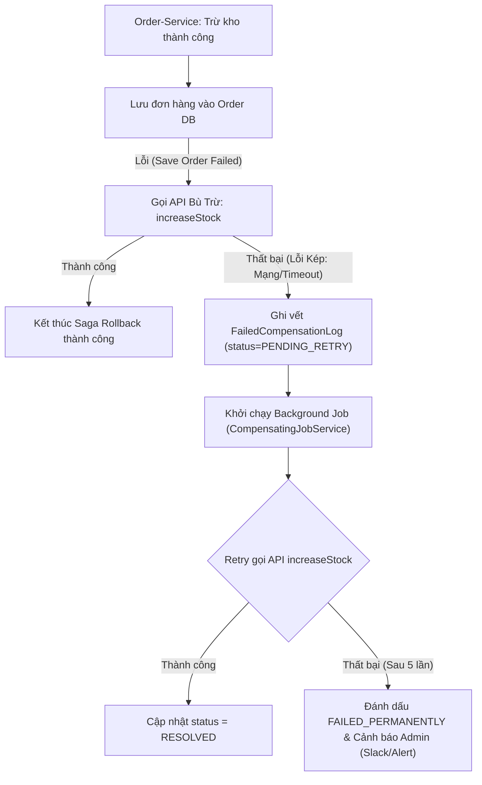

# BÁO CÁO PHÂN TÍCH VÀ PHÁT TRIỂN: VÁ LỖ HỔNG "KHO TREO" (SAGA ROLLBACK LOGIC)

---

## PHẦN A: NGUYÊN NHÂN NỀN TẢNG GÂY RA TÌNH TRẠNG "HÀNG ẢO"

### 1. Hiện tượng nghiệp vụ
Khách hàng đặt mua sản phẩm bị báo lỗi ở bước thanh toán / tạo đơn hàng (HTTP 500). Tuy nhiên, số lượng tồn kho của sản phẩm đó trên hệ thống lại bị trừ đi. Khi nhiều khách hàng gặp phải lỗi này, tồn kho về 0 gây ra hiện tượng **"Hết hàng ảo" (False Stock-Out)**, khiến cho những khách hàng thực sự có nhu cầu mua không thể đặt hàng được dù thực tế sản phẩm trong kho vẫn còn.

### 2. Nguyên nhân kỹ thuật trong mã nguồn kế thừa (Legacy Code)
Xét luồng xử lý cũ trong `OrderService.java`:

```java
public ResponseEntity<Order> createOrder(OrderRequest request) {
    // Bước 1: Gọi sang Inventory-Service để trừ kho (Thao tác làm thay đổi State ở service khác)
    boolean stockDecreased = inventoryClient.decreaseStock(request.getProductId(), request.getQuantity());
    if (!stockDecreased) {
        return ResponseEntity.badRequest().body(null);
    }

    Order order = new Order();
    order.setProductId(request.getProductId());
    order.setQuantity(request.getQuantity());
    order.setStatus("PENDING");

    // Bước 2: Lưu đơn hàng vào cơ sở dữ liệu địa phương của Order-Service
    try {
        orderRepository.save(order);
    } catch (Exception e) {
        // LỖI CHÍ MẠNG: Chỉ trả về HTTP 500 mà KHÔNG CÓ bước Bù Trừ (Compensating Transaction)
        return ResponseEntity.status(500).build();
    }

    return ResponseEntity.ok(order);
}
```

- **Sự mất nhất quán dữ liệu (Data Inconsistency)**:
  1. Trong kiến trúc Microservices, `Order-Service` và `Inventory-Service` sở hữu 2 cơ sở dữ liệu độc lập. Giao dịch database cục bộ (`@Transactional`) không thể bảo toàn tính nguyên tử (Atomicity) qua ranh giới mạng (Network Boundary).
  2. Bước 1 (`decreaseStock`) đã làm thay đổi trạng thái tồn kho bên `Inventory-Service` thành công.
  3. Bước 2 (`orderRepository.save`) gặp sự cố (Timeout database, cạn Connection Pool, lỗi Validation...).
  4. Khối `catch` ở mã nguồn cũ chỉ ghi log và trả về `HTTP 500`. Do không có bất kỳ lệnh gọi lại `Inventory-Service` nào để hoàn tác số lượng đã trừ, dữ liệu ở 2 microservices bị rơi vào trạng thái mất nhất quán vĩnh viễn: **Inventory-Service đã trừ kho, nhưng Order-Service không hề có đơn hàng tương ứng**.

---

## PHẦN B: MÃ NGUỒN TÁI CẤU TRÚC VỚI COMPENSATING TRANSACTION

Để khắc phục lỗ hổng trên, ta bổ sung bước **Bù Trừ (Compensating Transaction)** trong khối `catch` để hoàn trả lại số lượng kho khi việc lưu đơn hàng thất bại.

### Mã nguồn `OrderService.java` sau khi sửa

```java
package com.storex.order.service;

import com.storex.order.client.InventoryClient;
import com.storex.order.dto.OrderRequest;
import com.storex.order.model.FailedCompensationLog;
import com.storex.order.model.Order;
import com.storex.order.repository.FailedCompensationLogRepository;
import com.storex.order.repository.OrderRepository;
import lombok.RequiredArgsConstructor;
import lombok.extern.slf4j.Slf4j;
import org.springframework.http.ResponseEntity;
import org.springframework.stereotype.Service;

import java.time.LocalDateTime;

@Slf4j
@Service
@RequiredArgsConstructor
public class OrderService {

    private final InventoryClient inventoryClient;
    private final OrderRepository orderRepository;
    private final FailedCompensationLogRepository compensationLogRepository;

    /**
     * Tạo đơn hàng với cơ chế Bù Trừ (Compensating Transaction) chuẩn Saga Pattern
     */
    public ResponseEntity<Order> createOrder(OrderRequest request) {
        log.info("Starting order creation saga for productId={}, quantity={}", request.getProductId(), request.getQuantity());

        // 1. Gọi Inventory Service để trừ kho
        boolean stockDecreased = inventoryClient.decreaseStock(request.getProductId(), request.getQuantity());
        if (!stockDecreased) {
            log.warn("Decrease stock failed: Product out of stock. ProductId={}", request.getProductId());
            return ResponseEntity.badRequest().body(null);
        }

        log.info("Successfully decreased stock for productId={}. Proceeding to save order...", request.getProductId());

        Order order = new Order();
        order.setProductId(request.getProductId());
        order.setQuantity(request.getQuantity());
        order.setStatus("PENDING");

        // 2. Lưu đơn hàng vào DB với cơ chế bù trừ khi thất bại
        try {
            Order savedOrder = orderRepository.save(order);
            log.info("Order saved successfully with orderId={}", savedOrder.getId());
            return ResponseEntity.ok(savedOrder);
        } catch (Exception e) {
            log.error("CRITICAL ERROR: Save order failed due to: {}. Triggering Compensating Transaction...", e.getMessage());

            // BƯỚC BÙ TRỪ (COMPENSATING TRANSACTION): Hoàn lại số lượng kho
            boolean stockRestored = false;
            try {
                stockRestored = inventoryClient.increaseStock(request.getProductId(), request.getQuantity());
            } catch (Exception compensateEx) {
                log.error("COMPENSATE API FAILED (Network/Timeout): Cannot reach InventoryClient to restore stock!", compensateEx);
            }

            if (stockRestored) {
                log.info("COMPENSATED SUCCESSFULLY: Restored {} units of productId={} to inventory.", request.getQuantity(), request.getProductId());
            } else {
                // XỬ LÝ LỖI KÉP (DOUBLE FAILURE): Lưu vết vào DB để Background Job retry ngầm
                log.error("DOUBLE FAILURE: Stock compensation failed! Logging compensation event for background retry job.");
                saveFailedCompensationLog(request, e.getMessage());
            }

            return ResponseEntity.status(500).build();
        }
    }

    private void saveFailedCompensationLog(OrderRequest request, String reason) {
        try {
            FailedCompensationLog logRecord = FailedCompensationLog.builder()
                    .productId(request.getProductId())
                    .quantity(request.getQuantity())
                    .reason(reason)
                    .status("PENDING_RETRY")
                    .retryCount(0)
                    .createdAt(LocalDateTime.now())
                    .build();
            compensationLogRepository.save(logRecord);
            log.info("Saved FailedCompensationLog record into DB for productId={}", request.getProductId());
        } catch (Exception ex) {
            log.error("FATAL: Failed to save FailedCompensationLog into DB!", ex);
        }
    }
}
```

---

## PHẦN C: GIẢI PHÁP MẠNH MẼ CHO LỖI HOÀN KHO KẾP (DOUBLE FAILURE)

### 1. Thách thức "Lỗi Kép" (Double Failure Scenario)
Điều gì xảy ra nếu việc gọi phương thức bù trừ `inventoryClient.increaseStock` **cũng bị thất bại** (do rớt mạng, `Inventory-Service` bị sập hoàn toàn, hoặc Gateway Timeout)?
Nếu chỉ gọi bù trừ qua HTTP trực tiếp trong khối `catch`, khi gặp lỗi kép, kho hàng vẫn sẽ bị ngắt kết nối và không được hoàn lại.

### 2. Kiến trúc giải pháp: Saga Log State + Scheduled Retry Job (Outbox Pattern)



### 3. Triển khai Background Scheduled Retry Job (`CompensatingJobService.java`)

```java
package com.storex.order.service;

import com.storex.order.client.InventoryClient;
import com.storex.order.model.FailedCompensationLog;
import com.storex.order.repository.FailedCompensationLogRepository;
import lombok.RequiredArgsConstructor;
import lombok.extern.slf4j.Slf4j;
import org.springframework.scheduling.annotation.Scheduled;
import org.springframework.stereotype.Service;

import java.time.LocalDateTime;
import java.util.List;

@Slf4j
@Service
@RequiredArgsConstructor
public class CompensatingJobService {

    private final InventoryClient inventoryClient;
    private final FailedCompensationLogRepository compensationLogRepository;

    /**
     * Job chạy ngầm định kỳ quét và retry hoàn kho bù trừ cho các giao dịch bị lỗi kép
     */
    @Scheduled(fixedDelay = 10000)
    public void retryFailedCompensations() {
        List<FailedCompensationLog> pendingLogs = compensationLogRepository.findByStatus("PENDING_RETRY");

        if (pendingLogs.isEmpty()) {
            return;
        }

        log.info("[BACKGROUND SAGA JOB] Found {} pending compensation retries in database.", pendingLogs.size());

        for (FailedCompensationLog logRecord : pendingLogs) {
            try {
                log.info("Retrying stock restoration for logId={}, productId={}, quantity={}", logRecord.getId(), logRecord.getProductId(), logRecord.getQuantity());

                boolean restored = inventoryClient.increaseStock(logRecord.getProductId(), logRecord.getQuantity());

                if (restored) {
                    logRecord.setStatus("RESOLVED");
                    logRecord.setLastRetryAt(LocalDateTime.now());
                    compensationLogRepository.save(logRecord);
                    log.info("[BACKGROUND SAGA JOB SUCCESS] Successfully compensated logId={}! Stock restored.", logRecord.getId());
                } else {
                    logRecord.setRetryCount(logRecord.getRetryCount() + 1);
                    logRecord.setLastRetryAt(LocalDateTime.now());
                    if (logRecord.getRetryCount() >= 5) {
                        logRecord.setStatus("FAILED_PERMANENTLY");
                        log.error("[BACKGROUND SAGA JOB FAILED] LogId={} reached max retries (5). Marked FAILED_PERMANENTLY for manual audit.", logRecord.getId());
                    }
                    compensationLogRepository.save(logRecord);
                }
            } catch (Exception ex) {
                log.error("[BACKGROUND SAGA JOB ERROR] Failed retry attempt for logId={}: {}", logRecord.getId(), ex.getMessage());
                logRecord.setRetryCount(logRecord.getRetryCount() + 1);
                logRecord.setLastRetryAt(LocalDateTime.now());
                if (logRecord.getRetryCount() >= 5) {
                    logRecord.setStatus("FAILED_PERMANENTLY");
                }
                compensationLogRepository.save(logRecord);
            }
        }
    }
}
```

---

## PHẦN D: KẾT QUẢ KIỂM THỬ (UNIT TEST VERIFICATION)

Bộ kiểm thử đơn vị [OrderServiceTest.java](file:///d:/microservice/BaiTap/SS14/BaiTap1/src/test/java/com/storex/order/service/OrderServiceTest.java) đã kiểm chứng 5 kịch bản:
1. `createOrder_Success`: Trừ kho & Lưu DB thành công $\rightarrow$ Trả về `HTTP 200 OK`.
2. `createOrder_OutOfStock`: Sản phẩm hết hàng $\rightarrow$ Trả về `HTTP 400 Bad Request`.
3. `createOrder_SaveOrderFailed_CompensatedSuccessfully`: Lưu DB lỗi $\rightarrow$ Tự động kích hoạt bù trừ `increaseStock` thành công.
4. `createOrder_DoubleFailure_LogsCompensationForBackgroundRetry`: Lưu DB lỗi AND Bù trừ lỗi $\rightarrow$ Ghi nhận bản ghi `FailedCompensationLog` với trạng thái `PENDING_RETRY`.
5. `compensatingJobService_RetryPendingLogsSuccess`: Background Job quét các bản ghi `PENDING_RETRY` và phát lại giao dịch bù trừ thành công $\rightarrow$ Cập nhật `RESOLVED`.

```text
BUILD SUCCESSFUL in 3m 5s
4 actionable tasks: 4 executed
```
