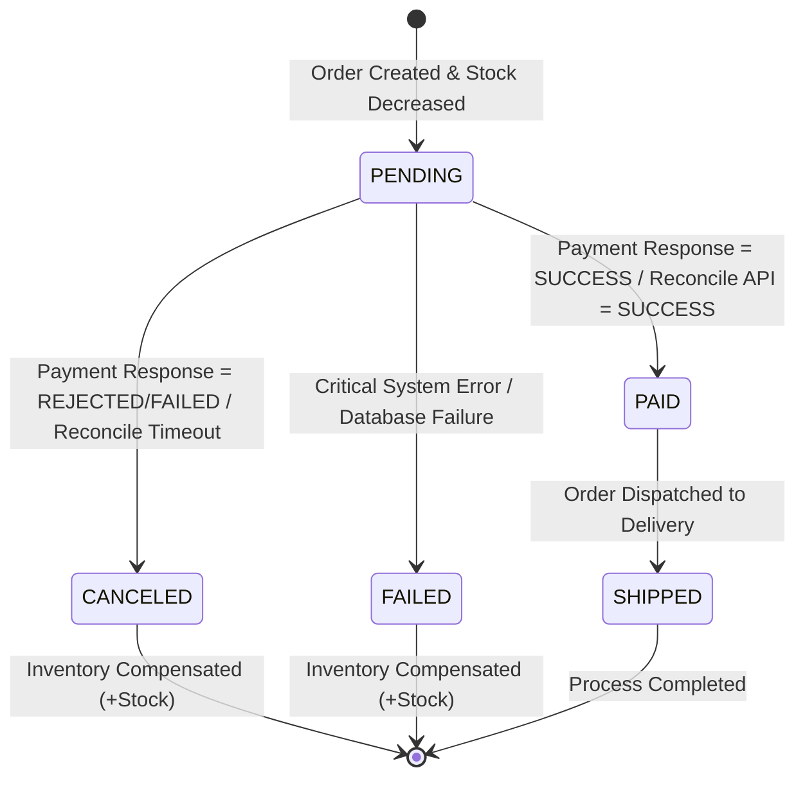

# BÁO CÁO PHÂN TÍCH VÀ GIẢI PHÁP - BÀI TẬP 2: ĐỒNG BỘ TRẠNG THÁI "ĐƠN HÀNG LẠC LỐI"

## 1. Phân Tích Hiện Trường Lỗi ("Đơn Hàng Lạc Lối")

### 1.1 Nguyên nhân gây ra đơn hàng bị treo PENDING
Trong mô hình kiến trúc Microservices, quá trình thanh toán thường diễn ra bất đồng bộ (Asynchronous Event / Webhook). Đơn hàng gặp tình trạng "lạc lối" (mất nhất quán trạng thái) do 2 tình huống chính:
1. **Mất kết nối mạng tại thời điểm nhận phản hồi (Transient Network Outage):** Payment Service đã trừ tiền thành công và gửi sự kiện `PaymentResponseEvent`, nhưng mạng bị gián đoạn giữa chừng khiến `PaymentEventListener` của Order Service không nhận được event.
2. **Lỗi xử lý hoặc Event bị thất lạc (Message Lost / Crash):** Broker hoặc Consumer bị sập đúng lúc message đang được truyền tải, dẫn đến đơn hàng giữ nguyên trạng thái `PENDING` vô thời hạn.

### 1.2 Hậu quả
* **Khách hàng bị trừ tiền nhưng không được xác nhận đơn hàng:** Gây ra bức xúc và làm tăng chi phí hỗ trợ khách hàng (Customer Support).
* **Kho bị khóa ảo dài hạn:** Tồn kho bị giữ cho đơn `PENDING` khiến sản phẩm không thể bán cho khách hàng khác.

---

## 2. Sơ Đồ Trạng Thái Đơn Hàng (State Machine)

Sơ đồ bên dưới thể hiện vòng đời của Đơn hàng từ khi khởi tạo đến khi hoàn tất hoặc bị hủy:



### Bảng Điều Kiện Chuyển Trạng Thái (State Transition Matrix)

| Trạng thái hiện tại | Sự kiện / Trigger | Điều kiện | Trạng thái mới | Hành động bù trừ (Compensating Action) |
| :--- | :--- | :--- | :--- | :--- |
| **NONE** | User Đặt hàng | Trừ kho thành công | **PENDING** | Không |
| **PENDING** | `PaymentResponseEvent` | `status == "SUCCESS"` | **PAID** | Không |
| **PENDING** | `PaymentResponseEvent` | `status IN ("REJECTED", "FAILED")` | **CANCELED** | Hoàn trả kho (`inventoryClient.increaseStock`) |
| **PENDING** | `OrderTimeoutScheduler` | Đơn > 5 phút & Reconcile API = `"SUCCESS"` | **PAID** | Không |
| **PENDING** | `OrderTimeoutScheduler` | Đơn > 5 phút & Reconcile API != `"SUCCESS"` | **CANCELED** | Hoàn trả kho (`inventoryClient.increaseStock`) |
| **PAID** | Order Fulfillment | Đơn hàng đóng gói & giao shipper | **SHIPPED** | Không |
| **PAID / CANCELED** | Nhận lại Event chậm (Late Duplicate Event) | Trạng thái đơn hàng đã ở Terminal Status | **Trạng thái cũ** | Bỏ qua (Tính Idempotency) |

---

## 3. Giải Pháp Kỹ Thuật Chi Tiết

### 3.1 Xử lý Event Phản hồi An toàn & Idempotent
* Kiểm tra trạng thái hiện tại của Đơn hàng trước khi cập nhật. Nếu đơn đã ở trạng thái `PAID` hoặc `CANCELED`, hệ thống bỏ qua event bị lặp (Idempotent Event Handling).
* Nếu thanh toán thất bại (`REJECTED` / `FAILED`), chuyển đơn sang `CANCELED` và gọi `inventoryClient.increaseStock()` để giải phóng tồn kho.

### 3.2 Xử lý Timeout bằng Cơ chế Đối Soát Chủ Động (Active Reconciliation)
* Cấu hình `@Scheduled` Job chạy định kỳ quét các đơn hàng ở trạng thái `PENDING` vượt quá thời hạn cho phép (ví dụ: 5 phút).
* **Cơ chế Reconcile API:** Thay vì hủy ngay lập tức, Order Service gọi REST API `checkPaymentStatus(orderId)` sang Payment Service để truy vấn trạng thái thanh toán thực tế:
  * Nếu Payment Service xác nhận đã trừ tiền thành công (`SUCCESS`) $\rightarrow$ Đồng bộ đơn hàng sang `PAID`.
  * Nếu Payment Service xác nhận thất bại/chưa thanh toán (`FAILED` / `NOT_FOUND`) $\rightarrow$ Chuyển đơn sang `CANCELED` và trả lại kho.

---

## 4. Mã Nguồn Đã Sửa Đổi

### 4.1 PaymentEventListener.java
```java
@Component
public class PaymentEventListener {

    private final OrderService orderService;

    public PaymentEventListener(OrderService orderService) {
        this.orderService = orderService;
    }

    @EventListener
    public void handlePaymentResponse(PaymentResponseEvent event) {
        orderService.processPaymentResponse(event);
    }
}
```

### 4.2 OrderService.java (Cập nhật Logic & Reconcile)
```java
@Transactional
public void processPaymentResponse(PaymentResponseEvent event) {
    Order order = orderRepository.findById(event.getOrderId())
            .orElseThrow(() -> new RuntimeException("Order not found with ID: " + event.getOrderId()));

    // Idempotency check: Bỏ qua nếu đơn hàng đã kết thúc
    if (order.getStatus() != OrderStatus.PENDING) {
        return;
    }

    switch (event.getStatus().toUpperCase()) {
        case "SUCCESS":
            order.setStatus(OrderStatus.PAID);
            orderRepository.save(order);
            break;

        case "REJECTED":
        case "FAILED":
            order.setStatus(OrderStatus.CANCELED);
            orderRepository.save(order);
            rollbackInventory(order);
            break;
    }
}

@Transactional
public void reconcilePendingOrders(int expirationMinutes) {
    LocalDateTime threshold = LocalDateTime.now().minusMinutes(expirationMinutes);
    List<Order> expiredPendingOrders = orderRepository.findByStatusAndCreatedAtBefore(OrderStatus.PENDING, threshold);

    for (Order order : expiredPendingOrders) {
        String paymentStatus = paymentClient.checkPaymentStatus(order.getId());
        if ("SUCCESS".equalsIgnoreCase(paymentStatus)) {
            order.setStatus(OrderStatus.PAID);
        } else {
            order.setStatus(OrderStatus.CANCELED);
            rollbackInventory(order);
        }
        orderRepository.save(order);
    }
}
```

### 4.3 OrderTimeoutScheduler.java
```java
@Component
public class OrderTimeoutScheduler {

    private final OrderService orderService;
    private final int expirationMinutes;

    public OrderTimeoutScheduler(OrderService orderService,
                                 @Value("${order.timeout.expiration-minutes:5}") int expirationMinutes) {
        this.orderService = orderService;
        this.expirationMinutes = expirationMinutes;
    }

    @Scheduled(fixedDelayString = "${order.timeout.check-interval-ms:60000}")
    public void schedulePendingOrderReconciliation() {
        orderService.reconcilePendingOrders(expirationMinutes);
    }
}
```
