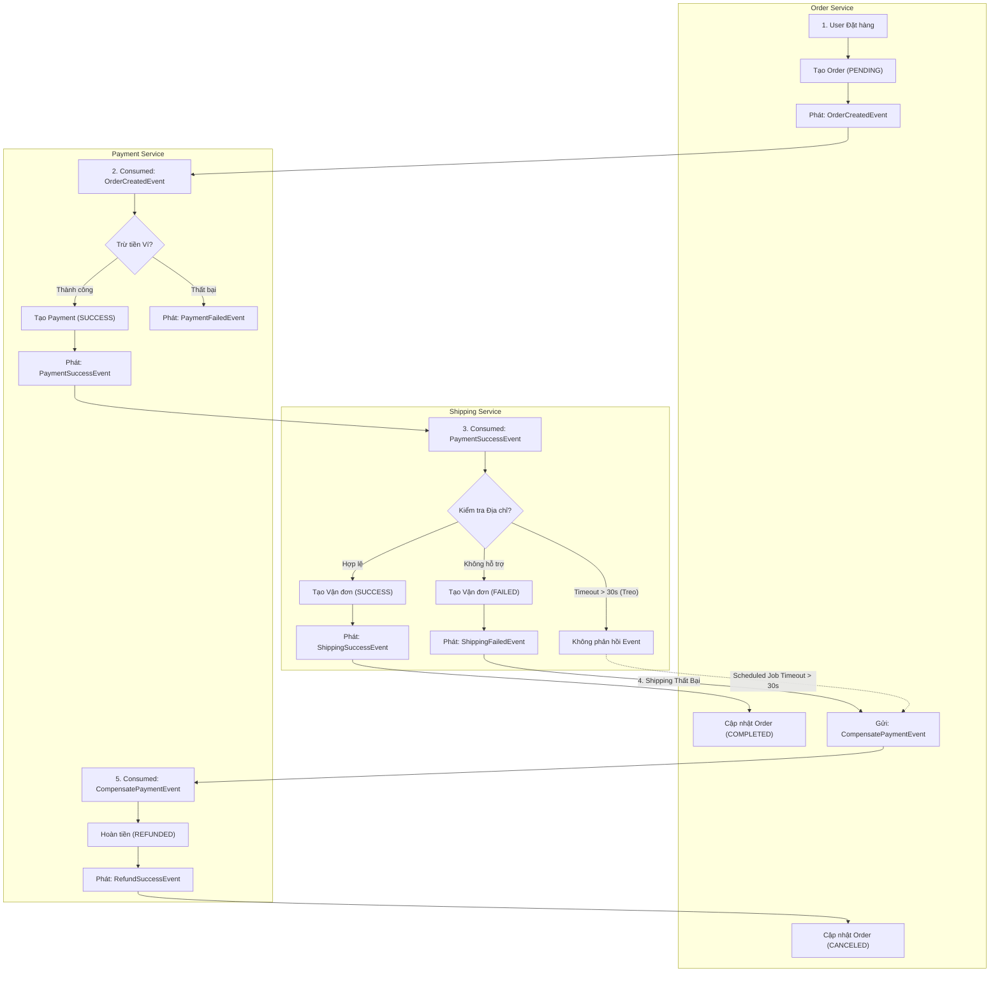

# BÁO CÁO PHÂN TÍCH VÀ THIẾT KẾ - BÀI TẬP 3: THIẾT KẾ VŨ ĐIỆU CHOREOGRAPHY SAGA

## 1. Phân Tích Đần Vào (Input) & Đầu Ra (Output)

Trong mô hình **Choreography Saga**, không có trung tâm điều khiển (No Central Orchestrator). Mỗi dịch vụ tự phản ứng độc lập dựa trên các sự kiện (Events) phát ra từ các dịch vụ khác.

### 1.1 Input (Thông tin đầu vào)
* **Thông tin Khách hàng (`customerId`):** Định danh người mua.
* **Thông tin Đơn hàng & Số tiền (`amount`):** Giá trị giao dịch cần trừ tiền từ tài khoản/ví.
* **Địa chỉ Giao hàng (`shippingAddress`):** Địa chỉ nhận hàng (cần kiểm tra tính hợp lệ và vùng hỗ trợ giao hàng).
* **Trạng thái Tồn kho:** Đã được kiểm tra và giữ trước khi khởi tạo Saga.

### 1.2 Output (Trạng thái cuối cùng của 3 Dịch vụ)

#### Trường hợp 1: Luồng Thành Công (Happy Path)
* **Order Service:** Trạng thái `COMPLETED`, cập nhật mã vận đơn `trackingNumber` (VD: `TRK-A1B2C3D4`).
* **Payment Service:** Trạng thái thanh toán `SUCCESS`, lưu mã giao dịch `paymentId`.
* **Shipping Service:** Trạng thái vận đơn `SUCCESS`, phát hành mã vận đơn.

#### Trường hợp 2: Luồng Bù Trừ khi Giao Hàng Thất Bại (Compensating Path)
* **Shipping Service:** Trạng thái vận đơn `FAILED` (do địa chỉ không hỗ trợ / ngoài vùng giao).
* **Payment Service:** Trạng thái thanh toán chuyển sang `REFUNDED` (hoàn trả 100% tiền cho khách hàng).
* **Order Service:** Trạng thái đơn hàng chuyển sang `CANCELED`.

---

## 2. Lưu Đồ Luồng Xử Lý (Flowchart)

Lưu đồ biểu diễn toàn bộ vòng đời Sự kiện giữa 3 Microservices:

---

## 3. Các Luồng Nghiệp Vụ Chi Tiết

### 3.1 Luồng Thành Công (Happy Path)
1. **Order Service:** Tạo đơn hàng ở trạng thái `PENDING` $\rightarrow$ Phát sự kiện `OrderCreatedEvent`.
2. **Payment Service:** Lắng nghe `OrderCreatedEvent`, trừ tiền khách hàng thành công $\rightarrow$ Lưu bản ghi `PaymentRecord(SUCCESS)` $\rightarrow$ Phát sự kiện `PaymentSuccessEvent`.
3. **Shipping Service:** Lắng nghe `PaymentSuccessEvent`, kiểm tra địa chỉ hợp lệ $\rightarrow$ Tạo vận đơn thành công $\rightarrow$ Phát sự kiện `ShippingSuccessEvent`.
4. **Order Service:** Lắng nghe `ShippingSuccessEvent` $\rightarrow$ Cập nhật trạng thái đơn hàng thành `COMPLETED` và lưu `trackingNumber`.

### 3.2 Luồng Bù Trừ khi Giao Hàng Thất Bại (Compensating Path)
1. **Shipping Service:** Lắng nghe `PaymentSuccessEvent`, phát hiện địa chỉ không được hỗ trợ $\rightarrow$ Lưu bản ghi `ShipmentRecord(FAILED)` $\rightarrow$ Phát sự kiện `ShippingFailedEvent`.
2. **Order Service:** Lắng nghe `ShippingFailedEvent` $\rightarrow$ Đổi trạng thái sang `COMPENSATING` $\rightarrow$ Phát sự kiện bù trừ `CompensatePaymentEvent`.
3. **Payment Service:** Lắng nghe `CompensatePaymentEvent` $\rightarrow$ Tiến hành hoàn tiền cho khách $\rightarrow$ Cập nhật bản ghi `PaymentRecord(REFUNDED)` $\rightarrow$ Phát sự kiện `RefundSuccessEvent`.
4. **Order Service:** Lắng nghe `RefundSuccessEvent` $\rightarrow$ Cập nhật trạng thái đơn hàng sang `CANCELED`.

---

## 4. Cơ Chế Xử Lý Timeout (30 Giây)

### 4.1 Vấn đề Timeout
Nếu `Shipping Service` bị sập, quá tải hoặc nghẽn mạng sau khi `Payment Service` đã trừ tiền thành công, hệ thống sẽ không nhận được bất kỳ `ShippingSuccessEvent` hay `ShippingFailedEvent` nào. Đơn hàng sẽ bị treo vĩnh viễn ở trạng thái `PAYMENT_SUCCESS`.

### 4.2 Giải pháp Timeout Compensating Job
1. **Timeout Threshold:** Quy định thời gian tối đa cho bước giao hàng là 30 giây.
2. **Active Timeout Checker (`checkShippingTimeout`):**
   * Định kỳ quét các đơn hàng có trạng thái `PAYMENT_SUCCESS` nhưng thời gian cập nhật đã vượt quá 30 giây.
   * Nếu phát hiện đơn bị quá hạn, Order Service chủ động đổi trạng thái sang `COMPENSATING` và phát sự kiện `CompensatePaymentEvent(reason: "Shipping Service Timeout (>30s)")`.
3. Chuỗi giao dịch bù trừ sẽ diễn ra tự động: **Payment Service hoàn tiền $\rightarrow$ Order Service hủy đơn.**

---

## 5. Cấu Trúc Mã Nguồn & Triển Khai

Mã nguồn được tổ chức hoàn chỉnh tại [SS14/BaiTap3](file:///d:/microservice/BaiTap/SS14/BaiTap3):

* **Event Bus:** [ChoreographyEventPublisher.java](file:///d:/microservice/BaiTap/SS14/BaiTap3/src/main/java/com/storex/saga/bus/ChoreographyEventPublisher.java) mô phỏng Event Broker (Kafka / RabbitMQ).
* **Order Service:** [OrderSagaService.java](file:///d:/microservice/BaiTap/SS14/BaiTap3/src/main/java/com/storex/saga/service/OrderSagaService.java)
* **Payment Service:** [PaymentSagaService.java](file:///d:/microservice/BaiTap/SS14/BaiTap3/src/main/java/com/storex/saga/service/PaymentSagaService.java)
* **Shipping Service:** [ShippingSagaService.java](file:///d:/microservice/BaiTap/SS14/BaiTap3/src/main/java/com/storex/saga/service/ShippingSagaService.java)
* **Unit & Integration Test:** [ChoreographySagaTest.java](file:///d:/microservice/BaiTap/SS14/BaiTap3/src/test/java/com/storex/saga/ChoreographySagaTest.java) kiểm thử 3 kịch bản: Happy Path, Shipping Failure Compensation, và Shipping Timeout 30s.
