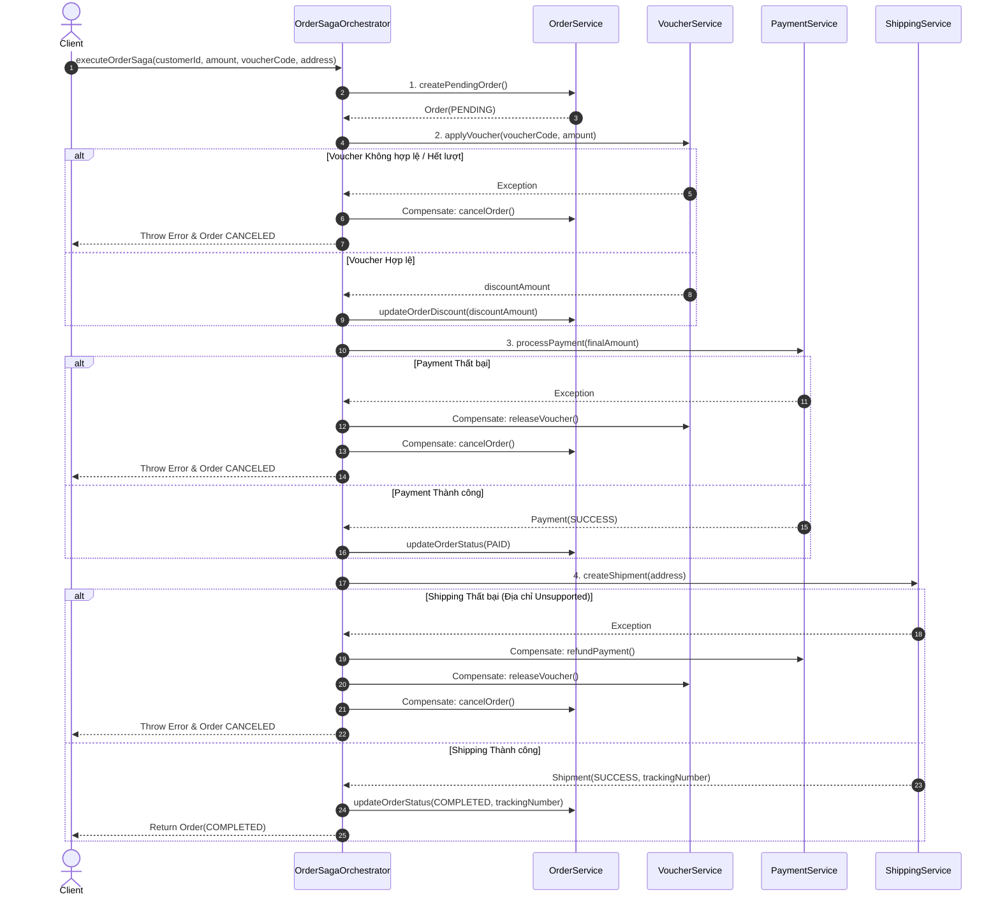

# BÁO CÁO PHÂN TÍCH VÀ ĐÁNH GIÁ - BÀI TẬP 4: SỰ ĐÁNH ĐỔI GIỮA TỰ DO VÀ TẬP TRUNG (CHOREOGRAPHY VS ORCHESTRATION SAGA)

---

## 1. Phân Tích Yêu Cầu Tích Hợp Voucher Vào Luồng Đặt Hàng

Khi hệ thống Thương mại điện tử (TMĐT) tích hợp dịch vụ **Voucher (Mã giảm giá)** cùng các dịch vụ phụ khác (**Loyalty Points**, **Notification**), quy trình xử lý đơn hàng yêu cầu tính chính xác tuyệt đối theo các bước:

1. **Khởi tạo Đơn hàng:** Nhận thông tin sản phẩm, số tiền gốc (`originalAmount`), mã Voucher (`voucherCode`) và địa chỉ giao hàng.
2. **Kiểm tra & Áp dụng Voucher (`VoucherService`):**
   * Kiểm tra mã Voucher có tồn tại trong hệ thống hay không.
   * Kiểm tra đơn hàng có đạt giá trị tối thiểu (`minOrderAmount`) để áp dụng hay không.
   * Kiểm tra lượt sử dụng (`usedCount < usageLimit`).
   * Tăng số lượt đã dùng (`usedCount + 1`) và tính toán số tiền giảm (`discountAmount`).
3. **Cập nhật Giá trị Đơn hàng (`OrderService`):**
   * Cập nhật `finalAmount = originalAmount - discountAmount`.
4. **Thanh toán (`PaymentService`):**
   * Trừ tiền khách hàng dựa trên `finalAmount` đã giảm giá.
5. **Giao hàng (`ShippingService`):**
   * Kiểm tra địa chỉ và phát hành mã vận đơn (`trackingNumber`).
6. **Bù trừ khi xảy ra lỗi (Compensating Transaction):**
   * Nếu thanh toán hoặc giao hàng thất bại, Voucher đã giữ phải được nhả lại (`usedCount - 1`), tiền đã trừ phải được hoàn lại (`REFUNDED`), và đơn hàng phải chuyển sang `CANCELED`.

---

## 2. Bảng So Sánh Chi Tiết: Choreography vs Orchestration Saga

| Tiêu chí | Choreography Saga (Tự do / Phân tán) | Orchestration Saga (Tập trung / Điều phối) |
| :--- | :--- | :--- |
| **Kiến trúc & Điều phối** | Không có bộ điều phối trung tâm. Mỗi service tự lắng nghe Event từ service trước để thực hiện action. | Có bộ điều phối trung tâm (`Saga Orchestrator`) chủ động gọi API/Event sang các service thành phần. |
| **Độ phức tạp khi thêm Service mới** | **Cao (Rối rắm):** Dễ xảy ra hiện tượng *Spaghetti Event Chain* hoặc lặp vòng tròn (Cyclic Dependency) khi thêm Voucher, Loyalty, Notification. | **Thấp (Đơn giản):** Chỉ cần cập nhật thêm 1 bước trong class Orchestrator mà không làm ảnh hưởng đến logic của các service khác. |
| **Khả năng giám sát (Observability)** | **Khó:** Không có nơi nào lưu giữ bức tranh tổng thể của Saga. Muốn debug phải truy vết log qua nhiều service (Distributed Tracing). | **Rất Dễ:** State của toàn bộ Saga được ghi lại tập trung tại DB của Orchestrator (`SagaStateData`). |
| **Độ trễ & Hiệu năng (Latency)** | **Thấp / Tối ưu hơn:** Giao tiếp async qua Message Broker giúp giảm tight-coupling và tối ưu hóa thời gian phản hồi. | **Hơi cao hơn:** Orchestrator đóng vai trò làm điểm trung gian điều phối làm tăng nhẹ thời gian hoán đổi context. |
| **Khả năng mở rộng (Scalability)** | Rất tốt cho các hệ thống nhỏ đến trung bình với ít bước giao dịch. | Phù hợp với các hệ thống TMĐT lớn, quy trình phức tạp có trên 4-5 bước nghiệp vụ. |
| **Dễ bảo trì (Maintainability)** | Phụ thuộc nhiều vào việc quản lý schema của Event. Khi Event thay đổi, nhiều service bị ảnh hưởng. | Dễ bảo trì và refactor do logic điều phối và bù trừ nằm tập trung tại Orchestrator. |

---

## 3. Lý Do Lựa Chọn Giải Pháp Orchestration Saga

Nhóm phát triển đề xuất lựa chọn mô hình **Orchestration Saga** cho quy trình đặt hàng tích hợp Voucher vì:
* **Loại bỏ hiện tượng "Spaghetti Event Chain":** Khi có thêm các bước phụ như Voucher, Tích điểm, Phân bổ kho, việc gửi event liên hoàn làm luồng dữ liệu cực kỳ khó kiểm soát.
* **Tập trung hoá Logic Bù trừ (Centralized Rollback):** Orchestrator nắm giữ chính xác bước nào vừa thất bại để kích hoạt chuỗi bù trừ ngược chiều (`Reverse Order Compensation`) một cách nhất quán.

---

## 4. Lưu Đồ Điều Phối (Orchestration Sequence Diagram)



---

## 5. Triển Khai Mã Nguồn Mô Phỏng (Spring Boot)

Chi tiết dự án nằm trong [SS14/BaiTap4](file:///d:/microservice/BaiTap/SS14/BaiTap4):

### 5.1 OrderSagaOrchestrator.java
```java
@Component
public class OrderSagaOrchestrator {

    public OrchestratorOrder executeOrderSaga(Long customerId, Double originalAmount, String voucherCode, String shippingAddress) {
        OrchestratorOrder order = null;
        SagaStateData sagaState = null;

        try {
            // STEP 1: Create Order
            order = orderService.createPendingOrder(customerId, originalAmount, voucherCode, shippingAddress);
            sagaState = new SagaStateData(order.getId(), "ORDER_CREATED");
            sagaStateRepository.save(sagaState);

            // STEP 2: Apply Voucher
            Double discount = voucherService.applyVoucher(voucherCode, originalAmount);
            orderService.updateOrderDiscount(order.getId(), discount);
            sagaState.setCurrentStep("VOUCHER_APPLIED");
            sagaStateRepository.save(sagaState);

            // STEP 3: Process Payment
            Double finalAmount = Math.max(0.0, originalAmount - discount);
            paymentService.processPayment(order.getId(), finalAmount);
            orderService.updateOrderStatus(order.getId(), OrchestratorOrderStatus.PAID, null);
            sagaState.setCurrentStep("PAYMENT_COMPLETED");
            sagaStateRepository.save(sagaState);

            // STEP 4: Create Shipment
            OrchestratorShipment shipment = shippingService.createShipment(order.getId(), shippingAddress);
            orderService.updateOrderStatus(order.getId(), OrchestratorOrderStatus.COMPLETED, shipment.getTrackingNumber());
            sagaState.setCurrentStep("SHIPPING_COMPLETED");
            sagaStateRepository.save(sagaState);

            return order;

        } catch (Exception e) {
            rollbackSaga(order, sagaState, voucherCode);
            throw new RuntimeException("Saga Execution Failed: " + e.getMessage(), e);
        }
    }

    private void rollbackSaga(OrchestratorOrder order, SagaStateData sagaState, String voucherCode) {
        if (order == null || sagaState == null) return;

        String currentStep = sagaState.getCurrentStep();
        sagaState.setCurrentStep("COMPENSATING");
        sagaStateRepository.save(sagaState);

        switch (currentStep) {
            case "PAYMENT_COMPLETED":
                paymentService.refundPayment(order.getId());
                voucherService.releaseVoucher(voucherCode);
                orderService.updateOrderStatus(order.getId(), OrchestratorOrderStatus.CANCELED, null);
                break;

            case "VOUCHER_APPLIED":
                voucherService.releaseVoucher(voucherCode);
                orderService.updateOrderStatus(order.getId(), OrchestratorOrderStatus.CANCELED, null);
                break;

            case "ORDER_CREATED":
                orderService.updateOrderStatus(order.getId(), OrchestratorOrderStatus.CANCELED, null);
                break;
        }

        sagaState.setCurrentStep("FAILED");
        sagaStateRepository.save(sagaState);
    }
}
```
